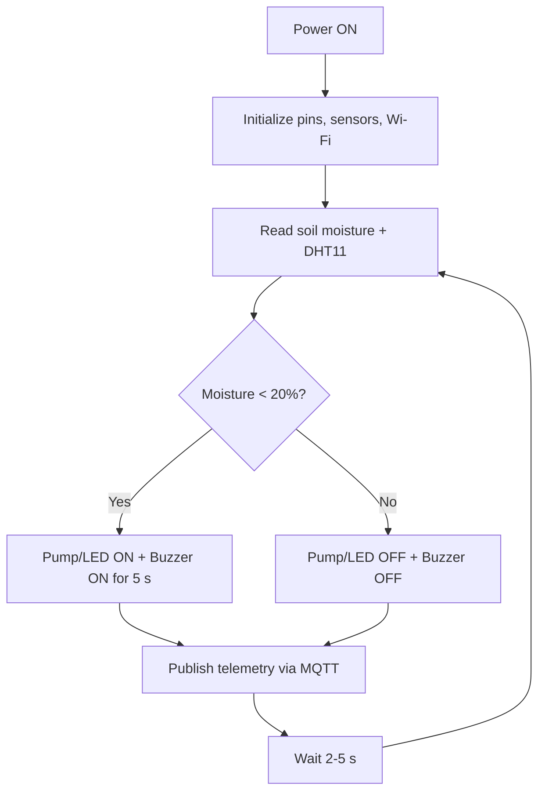
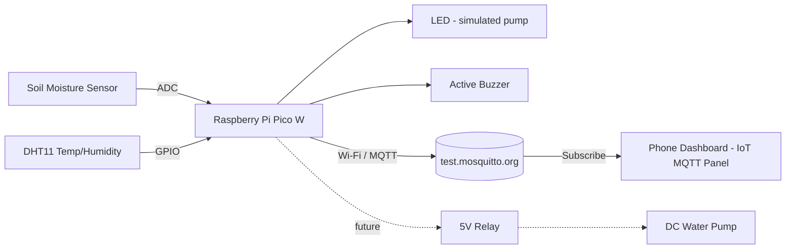

# [Embedded Systems] – Projects

## Smart Home Agriculture & Auto-Irrigation System (Raspberry Pi Pico W)

---

## 1. Our Idea

A **Smart Home Agriculture & Auto-Irrigation System** using **Raspberry Pi Pico W**.

The system monitors **soil moisture** and **ambient temperature/humidity** using sensors. If the soil is dry, it automatically triggers an **LED** (which can be replaced by a **water pump**). Real-time telemetry (moisture, temperature, pump status) is transmitted to a **mobile phone dashboard** over **Wi-Fi via MQTT**.

---

## 2. Project Structure

### Flow

1. **Initialize:** When powered on, the Pi Pico W sets up input/output pins, configures sensors, and connects to Wi-Fi.
2. **Read Sensors:** The system continuously reads soil moisture levels and ambient temperature/humidity.
3. **Control Logic:** If soil moisture drops below **20%** (dry soil), the controller triggers the relay to run the water pump for **5 seconds**.
4. **Wireless Transmission:** Current temperature, moisture levels, and pump status are sent over Wi-Fi (MQTT) to a smartphone app.



### Hardware Structure

- **MCU (Main Brain):** Raspberry Pi Pico W (handles calculations, sensor reading, and Wi-Fi transmission).
- **Inputs (Sensors):**
  - Soil Moisture Sensor (measures soil wetness).
  - DHT11 Sensor (measures air temperature and humidity).
- **Outputs (Actuators & Display):**
  - **LED:** simulates the water pump (ON = watering).
  - **Active buzzer:** audio alert when the soil is too dry.
- **Connectivity:** Wi-Fi telemetry to a phone via MQTT (`test.mosquitto.org`) and the MQTT Dashboard app.
- **Future work:** replace the LED with a 5V relay + water pump with **no change to the control logic**.

### Block Diagram

```text
 +----------------------+                          +------------------------+
 |  Soil Moisture Sensor|--- analog (ADC) -------->|                        |--> LED (simulated pump)
 +----------------------+                          |                        |
                                                   |    Raspberry Pi        |--> Active Buzzer (dry alert)
 +----------------------+                          |       Pico W           |
 |  DHT11 (Temp/Humid.) |--- digital ------------->|      (MicroPython)     |
 +----------------------+                          |                        |
                                                   +-----------+------------+
                                                               |
                                                               | Wi-Fi (MQTT publish)
                                                               v
                                                   +------------------------+
                                                   |  MQTT Broker           |
                                                   |  test.mosquitto.org    |
                                                   +-----------+------------+
                                                               |
                                                               | MQTT subscribe
                                                               v
                                                   +------------------------+
                                                   |  Phone Dashboard       |
                                                   |  (IoT MQTT Panel)      |
                                                   +------------------------+

 Future: LED  ==>  5V Relay Module  ==>  DC Water Pump
```



---

## User Interface (Phone Dashboard)

The user interface is a dashboard on the phone, built in an MQTT app (**IoT MQTT Panel**). Each tile subscribes to one MQTT topic published by the Pico W, so **no custom app has to be written**.

- **Soil moisture:** gauge with the 20% watering threshold marked.
- **Temperature and humidity:** live values from the DHT11.
- **Pump status:** ON/OFF indicator that mirrors the LED on the board.

*Figure: example phone dashboard (mockup)*

```text
+---------------------------------+
|  Smart Irrigation Dashboard     |
+---------------------------------+
|  Soil Moisture   [=====>   ]    |
|      35 %        (threshold 20%)|
+-----------------+---------------+
| Temperature     | Humidity      |
|   28 °C         |   65 %        |
+-----------------+---------------+
|  Pump Status:   (●) OFF         |
+---------------------------------+
```

---

## Required Parts & Tools

| Part | Why it's needed |
|------|-----------------|
| Raspberry Pi Pico W | Main controller (MCU). Reads the sensors, runs the control logic and connects to Wi-Fi to send data. |
| DHT11 sensor | Input. Measures air temperature and humidity, which is part of the telemetry sent to the phone. |
| Soil moisture sensor | Input. Measures how dry the soil is. This is the main signal that triggers the watering logic. |
| LED (+ resistor) | Output. Simulates the water pump: LED ON = pump running. Lets the full control logic be demonstrated without buying a pump. |
| Active buzzer | Output. Sound alert when the soil is too dry. |
| Breadboard + jumper wires | Connects all parts together without soldering. |
| Micro-USB cable | Powers the Pico W and uploads code from the laptop. |
| VS Code + MicroPico | Software used to write and upload MicroPython code to the Pico W. |
| MQTT broker (`test.mosquitto.org`) + MQTT Dashboard phone app | Free way to publish sensor data from the Pico W and see it live on a phone without building a custom app. |

---

## Development Limits

- Requires flashing **MicroPython firmware** onto the Pico W and setting up **Thonny** (or **VS Code + MicroPico**).
- The soil moisture threshold needs **manual calibration**: measure the sensor in fully dry and fully wet conditions to set the 20% cutoff.
- Data is sent **every 2 to 5 seconds** to limit Wi-Fi traffic and power use.
- The pump is simulated with an LED; real irrigation is **out of scope** for this version.

---

## Language & Tools

- **Language:** MicroPython
  *(MicroPython was chosen because Wi-Fi support on the Pico W was originally released for MicroPython first, and it lets development focus on the pipeline logic itself rather than low-level toolchain setup.)*
- **IDE:** VS Code with the MicroPico extension
- **IoT Platform:** MQTT (`test.mosquitto.org` broker) + MQTT Dashboard mobile app

---

## Purchase Links

| Item | Link |
|------|------|
| Raspberry Pi Pico W | https://fi.farnell.com/raspberry-pi/raspberry-pi-pico-w/raspberry-pi-board-arm-cortex/dp/3996082 |
| DHT11 Temperature & Humidity Sensor | https://www.partco.fi/en/arduino/arduino-playground/19992-dht11.html |
| Capacitive Soil Moisture Sensor | https://www.partco.fi/en/diy-kits/grove/23577-seeed-101020614.html |
| 5V Relay Module (1-Channel, Opto-isolated) *(future work)* | https://www.partco.fi/en/electromechanics/relays/relay-modules/23387-relaymod-1-iso.html |
| Vesipumppu (DC Water Pump) *(future work)* | https://www.partco.fi/fi/saehkoemekaniikka/moottorit/dc-moottorit/20206-mot-diy61289p.html |

### Parts usually available in the school lab (no purchase link needed)

- **LED** — giả lập pump (ON = đang tưới). Thường có sẵn ở lab trường, không cần link mua riêng.
- **Active buzzer** — báo động khi đất quá khô. Thường có sẵn ở lab trường, không cần link mua riêng.
- **Breadboard + dây jumper** — Thường có sẵn ở lab trường.
- **Cáp Micro-USB** — Thường có sẵn ở lab trường.
